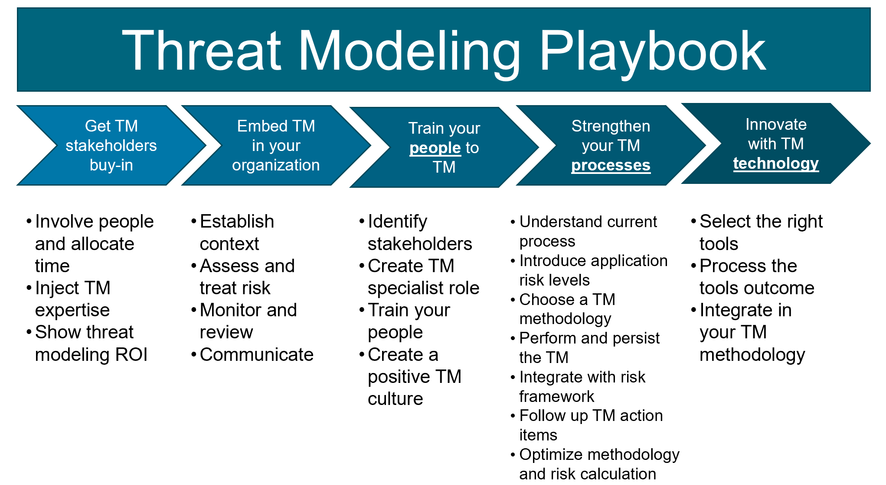

[![CC BY 4.0][cc-by-shield]][cc-by]

# Intro
We aim to improve product and software security with our new threat modeling playbook. We consider threat modeling as a foundational activity to improve your software assurance. We are convinced that a good threat modeling practice will measurably decrease security issues of delivered products. 

As strong believers in open source, active OWASP collaborators and to increase our impact beyond our Toreon computers we donate this threat modeling playbook to the community. 

We hope you will use this playbook to improve your threat modeling practice. We also encourage you to provide feedback to our OWASP threat modeling community in order to make this playbook even better in our next release. 

I thank our collaborators (in alphabetic order): Jonas Muylaert, Joris Van den Broeck, Sebastien Deleersnyder, Steven Wierckx and Thomas Heyman to help us create this first release. I also thank Toreon for its decision to donate this work to the threat modeling community. 

Sebastien Deleersnyder 

CEO Toreon 

OWASP volunteer 

10 September 2020

# Diagram

# Table of contents

### [1. Introduction](playbook/1.%20Introduction.md)
### [2. Get stakeholder buy-in](playbook/2.%20Get%20stakeholder%20buy-in.md)
### [3. Embed in your organization](playbook/3.%20Embed%20in%20your%20organization.md)
### [4. Train your people to threat model](playbook/4.%20Train%20your%20people%20to%20threat%20model.md)
### [5. Strengthen your threat model processes](playbook/5.%20Strengthen%20your%20threat%20model%20proces.md)
### [6. Innovate with threat model technology](playbook/6.%20Innovate%20with%20threat%20model%20technology.md)

# Authors
* ### Sebastien Deleersnyder
* ### Steven Wierckx
* ### Joris Van Den Broeck
* ### Thomas Heyman

# License

This work is licensed under a
[Creative Commons Attribution 4.0 International License][cc-by].

[![CC BY 4.0][cc-by-image]][cc-by]

[cc-by]: http://creativecommons.org/licenses/by/4.0/
[cc-by-image]: https://i.creativecommons.org/l/by/4.0/88x31.png
[cc-by-shield]: https://img.shields.io/badge/License-CC%20BY%204.0-lightgrey.svg