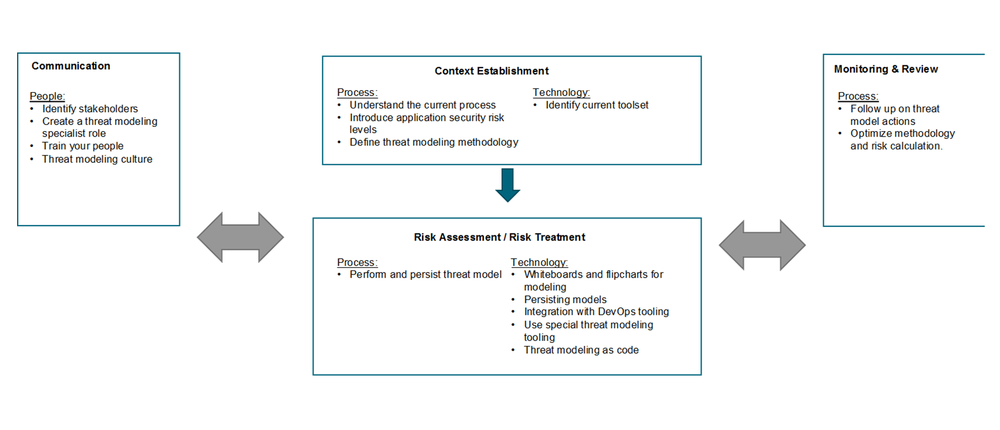

# 3. Embed in your organization

Threat modeling is a methodology to identify risks and hence should be integrated in your organizations’ risk management process. As a best practice we look at the risk management process described in ISO27005:2018 and map our threat modeling activities on this process.

We visualized a simplified overview of the main stages, who are part of the risk management process in Figure 1. We can summarize the threat modeling activities in three categories:

* People: who to involve how
* Process: which processes need to exist or need to be adapted
* Technology: which tools and technologies can help and facilitate threat modeling

The risk management stages we consider for threat modeling are:

* Context establishment
* Communication
* Risk assessment and treatment
* Monitoring and review

In each of these stages, we map related threat modeling activities. These threat modeling activities are grouped by people, process, or technology categories.

## 3.1 Context establishment

First, you need to understand how your organization handles and manages risk. The same risk can have a totally different impact in different organizations. For threat modeling the following activities are important concerning context establishment:

#### **Process**:
* 5.1  Understand the current process: it is crucial to understand existing processes in your organization and how to integrate threat modeling in them.

* 5.2  Introduce application security risk levels: by using application security risk levels and deciding when to apply threat modeling you can focus on the most important applications first. 

* 5.3 Define threat modeling methodology: there are many ways to define a threat model. You should select the methodology that fits your organization best. 

#### **Technology**:
*	6.1 Identify current toolset: identify tools and technologies used in your organization. This will help to assess how to integrate threat modeling in the existing toolset.

## 3.2	Risk assessment and treatment

Secondly, you execute the threat modeling activity as part of the risk assessment stage. Here you follow the selected threat modeling methodology.

#### **Process**:
*	5.4  Perform and persist threat model: you create and store your threat model.

#### **Technology**:
*	6.1 Whiteboards and flipcharts for modeling: most threat modeling methodologies are easy to start on a whiteboard or flipchart.

*	6.2  Persisting models: tools and technology to store threat models.

*	6.3  Integration with DevOps tooling: when working in a development environment, integrating with the development tooling is highly recommended.

*	6.3  Use special threat modeling tooling: threat modeling tools exists that can support you to threat model.

*	6.3  Threat modeling as code: following infrastructure as code – threat modeling as code also exists and can have several benefits.

The identified risks should be handled according to the risk management policy/process in use in your organization. The first step is to consider different risk treatment options such as: risk reduction, risk retention, risk avoidance or risk transfer. Based on a cost / benefit calculation, you select your best options.

## 3.3 Monitoring & review

Thirdly, risks are not static and will change over time. Exposure of the vulnerability leading to the risk may change, sensitivity of the information in the application may change, a risk may not be remediated in time, and so on. Hence it is important that your risks and their factors are regularly monitored and reviewed. For threat modeling this consists of the following activities:

#### **Process**:
*	5.6  Follow up on threat model actions: action should be taken on findings that come out of a threat model. 

*	5.7  Optimize methodology and risk calculation: to facilitate continuous improvement, you should monitor and optimize your threat modeling methodology. 

## 3.4	Communication
Finally, communication is key when creating a threat model. It is not possible to create a proper threat model without collaboration.

## **People**:
*	4.1  Identify stakeholders: different stakeholders you involve in creating a threat model. 

*	4.2  Create a threat modeling specialist role: a threat model specialist role will facilitate threat modeling in your organization. 

*	4.3  Train your people: security awareness is critically important. Threat modeling training is a must when you start with threat modeling.

*	4.4  Threat modeling culture: it is important to create a supporting culture for threat modeling.

[<< Previous page](2.%20Get%20stakeholder%20buy-in.md) | [Main page](../README.md) | [Next page >>](4.%20Train%20your%20people%20to%20threat%20model.md)
| --- | --- | --- |

