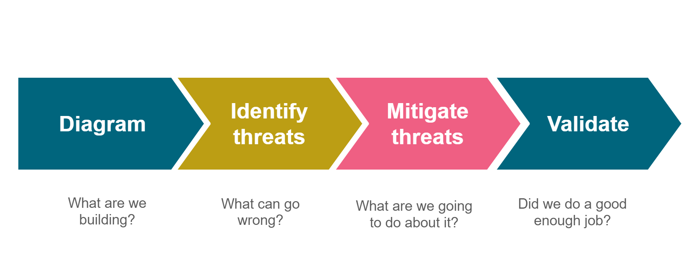

# 5	Strengthen your threat model processes

Setting up the right processes is vital for increasing the maturity level of your threat model. This chapter of the playbook will guide you in setting up or updating these processes. When determining your process of threat modelling, you must first understand your current processes in place, as mentioned in chapter 5.1. You will need to determine the application risk level to see what threat model activities need to be performed and why, chapter 5.2 will guide you in doing this. Chapter 5.3 will assist you in choosing the correct methodology that must be used when developing a threat model. In chapter 5.4 we will discuss ways to persist your threat model according to their deliverables. The integration of your threat model with your risk management framework will be discussed in chapter 5.5. Chapter 5.6 will give you an insight on how to follow up on mitigations that were produced by your threat model. The last chapter 5.7, elaborates on different processes that already exist and how your threat model process can interact with these processes.

## 5.1 Understand your current process

OWASP SAMM [6] describes threat modeling in the SAMM threat assessment practice. Basic threat modeling should include best-effort, risk-based threat modeling using brainstorming and existing diagrams with simple threat checklists.

To determine where to introduce threat modeling in your organization, it is helpful to understand and document your current threat modeling processes. Make sure you have a basic understanding of what your teams are doing (if they do threat modeling at all). When do you carry out threat modeling? What kind of inputs and outputs do you have? What steps are taken? 

We recommend drawing a basic overview of your current threat modeling steps. Use this drawing as a map together with this playbook to see where you can improve your existing threat modeling based on the activities described in this playbook.

## 5.2	Introduce application risk levels

As threat modeling can be a time-consuming activity you need to decide for what applications you are going to do this. Typically, applications will not all have the same risk level within your organization. We recommend ordering your applications in different risk “buckets” or risk profiles. Usually, you use three risk profiles: high, medium, and low risk. When you have application risk levels you can leverage other OWASP resources that rely on these levels, such as OWASP SAMM  or OWASP ASVS [7].

But first you will need to define the application risk profile levels and a classification method that work for your organization. The level of risk for a system will determine the level of threat model activities that need to be performed to protect them. For more information on the risk related processes you can consult chapter 3.

Use a simple method to evaluate the application risk per application, estimating the potential business impact that it poses for your organization in case of an attack. This is also explained in the Application Risk Profile activity of OWASP SAMM. An example and simple risk classification into three levels can use the following scheme:

* Level 1 (low risk) is for systems that contain no critical data and complete loss, data theft etc. will have no impact on your organization. Examples: application to reserve a parking spot, application to order lunch … These applications do not need a full-blown threat model.
* Level 2 (medium risk) contains all systems not in level 1 or level 3. In practice these are systems that are not critical but do contain sensitive data such as GDPR impacted data etc. These systems need a threat model that handles the use cases of this system. 
* Level 3 (high risk) systems are those systems that contain very sensitive data, large amounts of sensitive data or that control processes that, if compromised, threaten the existence of your organization. Examples: applications that process intellectual property, systems that result in actions in the physical world and could harm people (safety aspect). These systems need a threat model that goes into great detail and might go into very detailed systems aspects, up to inter-process communication on a CPU if that is part of your system scope.

Data is considered sensitive if compromising the data would negatively impact your organization.

## 5.3	Choose a threat modeling methodology

There is only one rule when it comes to choosing a threat model methodology. If it works for you, keep it. If not, change it. This is a very pragmatic approach but does not allow us to compare and evaluate different threat model methodologies.

A threat model methodology should at least answer the following questions/steps:

These steps are:

#### **Diagram the application.**
A detailed understanding of the mechanics of your application makes it easier for you to uncover more relevant and more detailed threats. This includes the identification of security objectives. Clear objectives help you to focus on the threat modeling activity and determine how much effort to spend on subsequent steps. Itemizing your system's important characteristics and actors helps you to identify relevant threats during the next step.

#### **Identify threats.**
Use details from the previous step together with techniques to identify threats relevant to your system scenario and context. Examples of such techniques are attack trees [8], STRIDE [9], LINDDUN [10], etc.

#### **Mitigate Identify vulnerabilities.**
Review the layers of your system to identify weaknesses related to your threats. Use vulnerability categories to help you focus on those areas where mistakes are most often made.

#### **Validate.**
Validate the whole threat model. Is each threat mitigated? If not: is the residual risk clearly explained and tied into business risk. Scoping of security tests is typically done during this step.

Evaluating a threat model methodology can be split in 2 distinct steps:

1.	Evaluate the soundness of the methodology
2.	Evaluate if the methodology works for you

Academic research (Yskout, et al., 2020) shows us the elements, that should be present in an effective threat model methodology:

*	Model based
*	Traceable
*	Systematic
*	Business integration
*	Context aware
*	Scalable

A recent overview of different threat model methodologies can be found in this master’s thesis from Selin Juuso (2019). Once you eliminated all threat model methodologies that do not have these elements you will have a list of potential candidates for your organization. You should also already have an idea of the requirements for the methodology. Are you looking for a pragmatic approach or rather a formal approach? Who will be the main stakeholders and users of the methodology? Do you have generic security and compliance requirements and can the methodology handle those? Do you have an established risk calculation methodology, and can the methodology apply this?

Evaluating if a threat model methodology is going to work in your organization often requires you to have at least one try-out of the methodology. It is strongly advised to hire the help of a specialist in the methodology when doing this.

In an ideal world the threat model methodology gives you sufficient tools and techniques to answer the 4 questions no matter what type of system/application of your organization is being assessed. In reality there might be such a diverse ecosystem of assets to threat model, that techniques of other methodologies might need to be applied. This should be a minority of the cases and we should keep the first and only rule in mind: if it works for you, keep it. If not, change it.

## 5.4 Perform and persist the threat model

Once a threat model is created, you should persist or store your threat model for later reference, or if you want to update it. There are two types of deliverables that are created after each threat model - and for each of them different options are available to persist them.

* Threat modeling supporting files: all artifacts created to perform the threat model e.g. data flow diagrams, architectural drawings, questionnaires, documentation, meeting minutes or STRIDE analysis.
    * These can be stored in the platform your squad is using, e.g. SharePoint [11], MS Teams [12], G Suite [13], Azure DevOps [14], JIRA [15], … 
* Risks identified in the threat model.
    * Stored in the risk register, stored in a bug/user-story system, ... 
    * For each identified risk you should include a risk level and the agreed upon follow-up action.
  
Whatever tool you use, we recommend storing your threat modeling artifacts as close as possible to your team documentation or source code repository. We also recommend using tools that the involved people can easily use.

## 5.5 Integrate with your risk management framework

To ensure risks identified in the threat model are properly handled, a defined and management supported risk management framework is recommended. Without an agreed manner on how to handle risks – anything identified in the threat model will float around in empty spaces without actions or owners. You can have your own risk management framework, or you can derive one from the aforementioned ISO 27005 standard.

The following components are essential to ensure action is taken upon risk identified during threat modeling: 

* <u>Risk level</u>:It should be possible to clearly identify the risk level for each risk to your organization. The risk level can depend on your business, type of application, data involved, or etc. The description of the risk level should include all the necessary components. When included, you can determine the specific risk level for a certain risk, that is representative for the risks posed to your organization. 
* <u>Implications of the risk level:</u> an agreement on which actions to take based upon the risk level. Based on the risk threshold of your organization, an agreement is necessary on what to do with each level of risk. E.g. will a critical risk be resolved in one week? What happens when the risk is not resolved within one week? 
* <u>Risk escalation and acceptance:</u> when a risk is not taken up and the risk level is sufficiently high, a risk escalation procedure must be followed. In addition, risk acceptance must be possible. 
* <u>Risk review process:</u> it is necessary to regularly review identified risk and whether appropriate action is taken. This can be done by reviewing a risk register or by reviewing user-stories or bugs in tools like JIRA or Azure DevOps.

Make sure you identify these components in the risk management process in use at your organization and integrate your threat modeling methodology into these. If these are not present, your first step is to bootstrap a basic risk management process and agree on the essential components listed above with your key stakeholders.

## 5.6	Follow-up threat modeling action items

One of the most important outcomes of a threat model is the list of mitigations and the order in which they need to be implemented. Many organizations struggle with this process. A perfect threat model is almost useless if the mitigations are not followed up upon.

Start with creating a follow-up process. This process should ensure that every agreed upon action is implemented or executed by the assigned due date or handle any deviation from that plan. This process will certainly need to capture the following elements:

* Who is accountable for the progress and due date?
* What is the current status of the mitigation?
* What is the risk of the mitigation?
* Who is responsible for the execution / implementation? What are the actions that are needed?
* What is the current state of each of the actions needed to finish this mitigation?

Keep in mind that the risk level of threat modeling findings will change over time and might require new due dates and re-ordering of mitigations.

## 5.7 Optimize methodology and risk calculation

Threat modeling might be new to your organization, but elements of the threat model process are probably already being produced. Examples are architecture diagrams, user stories, risk handling methodologies and risk calculation methodologies, security baselines like the CIS guide etc.

Where possible you will want to re-use these since the process to gather them already exists and the effort to create the information is already done. It might be needed to adapt or enhance certain pieces of information to make them more applicable or more efficient for use in threat modeling.

Several other activities can provide input for threat modeling. For example, the penetration test reports might hint to a structural problem in the architecture, risk assessment done in the beginning of the project (e.g. the business case) might provide valuable information on the expected return for the system and could point to associated threats. There might be the need for compliance to certain legislation coming from the DPO office or your legal team. They might also already have defined the requirements for the audit trails the system needs to provide. Your service delivery team might provide you with expectation on the quality of service that they will want to put in SLA’s together with the marketing/sales team etc.

When you start the threat model process you need to have a good overview on all other processes in your organization in order to make the most efficient use of the limited resources available. In the same sense the threat model can be used as input for other activities such as test automation, penetration testing, training, awareness etc.

And last but not least you might want to align or standardize on an organization wide risk calculation framework. This can be based on CVSS [16], the OWASP risk rating methodology [17] or any other methodology that makes sense for you teams. It does not really matter which calculation methodology you use, as long as you agree on a consistent way of implementing it within your organization. This way you can compare and manage the outcomes of your threat models across different teams.

[<< Previous page](4.%20Train%20your%20people%20to%20threat%20model.md) | [Main page](../README.md) | [Next page >>](6.%20Innovate%20with%20threat%20model%20technology.md)
| --- | --- | --- |

[6]: 7.%20Glossary%20of%20terms.md
[7]: 7.%20Glossary%20of%20terms.md
[8]: 7.%20Glossary%20of%20terms.md
[9]: 7.%20Glossary%20of%20terms.md
[10]: 7.%20Glossary%20of%20terms.md
[11]: 7.%20Glossary%20of%20terms.md
[12]: 7.%20Glossary%20of%20terms.md
[13]: 7.%20Glossary%20of%20terms.md
[14]: 7.%20Glossary%20of%20terms.md
[15]: 7.%20Glossary%20of%20terms.md
[16]: 7.%20Glossary%20of%20terms.md
[17]: 7.%20Glossary%20of%20terms.md